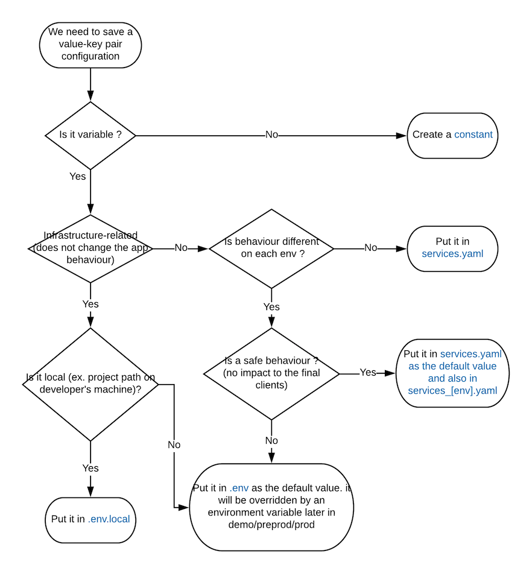

=========================================
Configuration for the symfony application
=========================================

Location of configuration
=========================

Environment variables
=====================

Environment variables can be used to configure the application. They can be put
in several places for the application to read. There is an order of precedence,
which means that values put in some locations will override those specified in
others. Here is the order, starting with the lowest priorities:

Symfony secrets
---------------

Secrets are setup using the symfony console. Adding a secret can be done by anyone,
decryption requires a key.

For more information regarding secrets, you can visit the `Official documentation <https://symfony.com/doc/current/configuration/secrets.html>`_

WARNING: in production like environments, secrets are usually dumped in the local environment (see below).

General environment file
------------------------

Path is ``.env``, this contains general and default values.

Specific environment file
-------------------------

Path is ``.env.<environment>`` where ``<environment>`` is the name of the env.
This will contain values specific to the environment and overrides default values.

Local environment files
-----------------------

The environment can be setup on a machine using local environment files. Those files
can be located at ``.env.<environment>.local`` or ``.env.local``. Those files should be
created on the machine and not be versioned since they depend on the location of the code.

In live environments (on AWS), secrets are dumped in those files, thus artificially
increasing their priority over ``.env`` files. They are then included in the PHP local
environment file.

PHP local environment file
--------------------------

Path is ``.env.local.php``. This file is created by compiling all environment
files in order to get a unique source that is easier to read by the application.

We perform this operation in live environments, which means it includes the value
of symfony secrets.

Actual environment variables
----------------------------

The setup of those variables depends on the execution context. When running a command,
the actual environment is used, but for the API, actual environment variables are not read
by the application, they need to be set in the fpm configuration. Those files have the following
syntax and need to be setup for a php-fpm pool:

.. code-block::

 [www]
 env[VAR1_NAME]="Var1 value"
 ;comment
 env[VAR2_NAME]="Var2 value"

Defining an environment
=======================

Symfony offers an environment mechanism that allows for good configuration options using env files
and configuration files in specific directories. However, we realized that most of our environments
were extremely similar and that all different values could be overriden by environment variables.

That is why we introduced ``KLS_ENV`` as a new variable to name environments. This allows for a more
dynamic setup of new environments, especially with very similar configurations.

KLS environments are an instance of Symfony environments. For example, we can have a Symfony environment
named ``staging`` that will have many instances like ``preprod``, ``integration`` and ``demo``. This
will be translated as:

.. code-block:: bash

  APP_ENV=staging
  KLS_ENV=preprod

.. code-block:: bash

  APP_ENV=staging
  KLS_ENV=integration

.. code-block:: bash

  APP_ENV=staging
  KLS_ENV=demo
