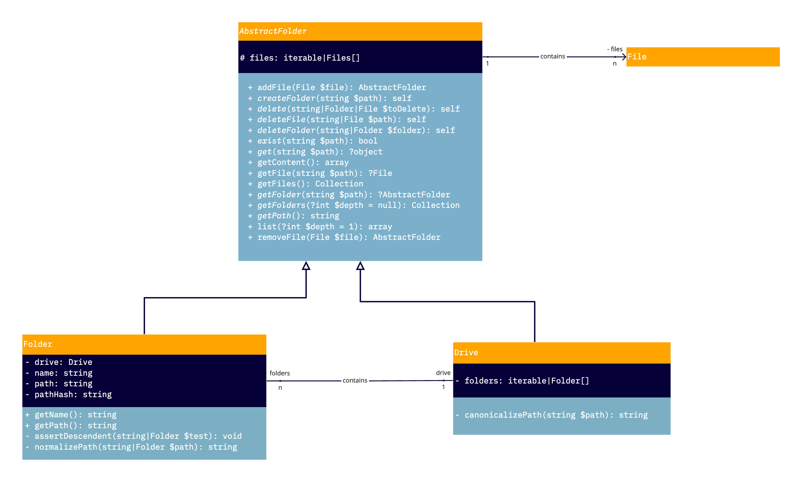

`Return to index <../../index.rst>`_

========
Dataroom
========

The dataroom functionality of our platform is a place for our users to stores documents related to various
project created. You can think of it as a small filesystem. Intially developped for the Agency service of our Syndication product, it can and should be integrated to
our other future products and services.

Entity
------

Drive
^^^^^

The dataroom operate around the concept of drives (analogous to a hard drive).
These drives contains the list of each folder present in said drive.
This property is a collection of folder indexed by the path of each folder.

The file collection in the drive house the files of its root folder.

Folder
^^^^^^
The folders themselves contains : 

* a path : This path is the absolute path from the root
* a file collection
* a reference to the drive housing them
* a hash of the path : this is to calculate the unicity of the path in a given drive. It is impossible to have a unique index on a SQl TEXT field.
It is also difficult to have a virtual column and Doctrine managing it. 
This field ensure there is only instance of each path with the drive as there is an unicity index based upon this hash and the reference (id) of the drive.

Controller
----------
To ease implementation, the following controllers are available. They expect a ``Drive $drive`` as the first argument and a ``string $path`` for the second.
In all the controllers below, should the path not exist in the drive, a 404 error is returned.

``\KLS\Core\Controller\Dataroom\Get``
^^^^^^^^^^^^^^^^^^^^^^^^^^^^^^^^^^^^^
This controller fetch and return the object present at ``$path`` in ``$drive``. 
If the object is a folder, then a serialized json representation is returned.
If the object is a file and ``application\octet-stream`` is an acceptable response type (it is present in the Accept header), then it is a file download.
Therefore, we return the physical file as response (setting the correct content-type header) and log the download attempt.
Otherwise, we return a json serialized representation of the file.

``\KLS\Core\Controller\Dataroom\Post``
^^^^^^^^^^^^^^^^^^^^^^^^^^^^^^^^^^^^^^
For this controller, ``$path`` represent the parent folder. 
``$path`` is expected to point at a folder or a drive (for the root folder). If that is not the case (either because ``$path`` points to nothing or it point to a folder), a 404 error is returned.
The request only upload files or create a folder, but not both at the same time.
If you want to create a folder, there is only one mandatory parameter ``$name``. This name can contain /. Each part between a / will be considered as a folder to create. They will be created recursively.
For files, the request is expected to be in ``multipart/form-data``. We take all files found in the ``$request->file`` collection and try to add the the folder present at ``$path``.
We use the client names (the name displayed in the file selection dialog when selecting one) name of the files.

``\KLS\Core\Controller\Dataroom\Delete``
^^^^^^^^^^^^^^^^^^^^^^^^^^^^^^^^^^^^^^^^
This controller delete the element present at ``$path``. 
If there is no path given, we consider it as an attempt to delete the drive and a 403 error is returned.

To further help with the implementation of a route having these as a controller, the ``\KLS\Core\Entity\Interfaces\DataroomListener`` will extract a drive base on the request data.
Should the request data contains an object implementing ``\KLS\Core\Entity\Interfaces\DriveCarrierInterface``, the listener will try with the PropertyAccessor componant to access the path set at the request attribute drive.
This attribute takes by default the value drive.

PS: This was implemented as a listener instead of a ``ArgumentResolver`` because we do not have access to the controller in a ``ArgumentResolver``

Below an example of route having ``\KLS\Core\Controller\Dataroom\Get`` as a controller using the ``\KLS\Core\Entity\Interfaces\DataroomListener``:

.. code-block:: php

    *         "get_borrower_dataroom_confidential": {
    *             "method": "GET",
    *             "path": "/agency/projects/{publicId}/borrowers/dataroom/confidential/{path?}",
    *             "controller": Get::class,
    *             "requirements": {
    *                 "path": ".+" // This is to allow / as a character in the argument.
    *             },
    *             "defaults": {
    *                 "drive": "borrowerConfidentialDrive" // Custom drive path
    *             },
    *         },

Restrictions
------------
There cannot be two items (file or folder) with the same name in the same folder. An attempt to do so will be ignored by the entity but will raise an exception
within the controllers.

We cannot rename a folder or a file for now.

We cannot put specific security rule on specific file or folder. It has to be on drive level.

The names of the items should not contains a ``/`` as it is the delimiting character.

Schema
------

