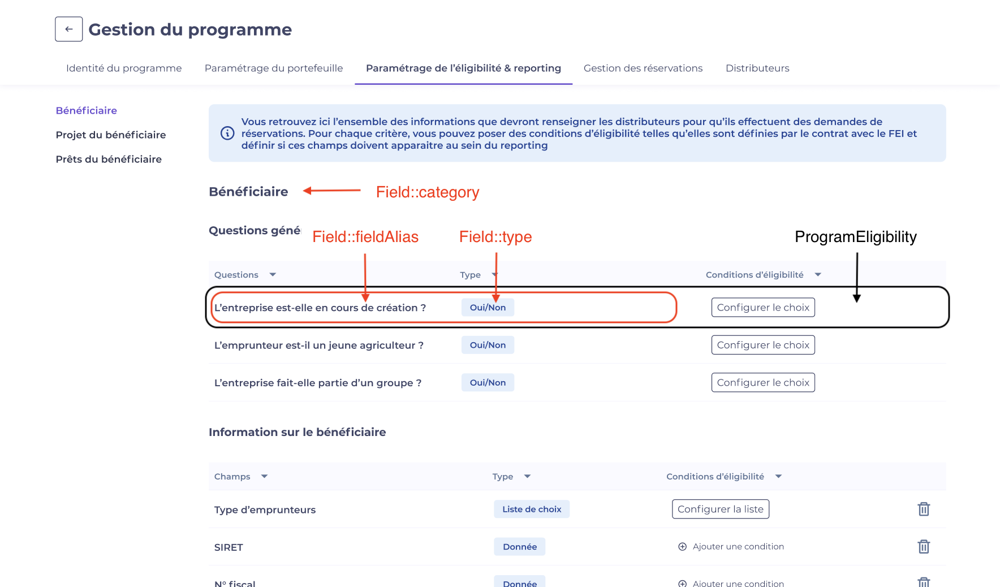
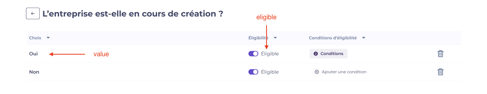
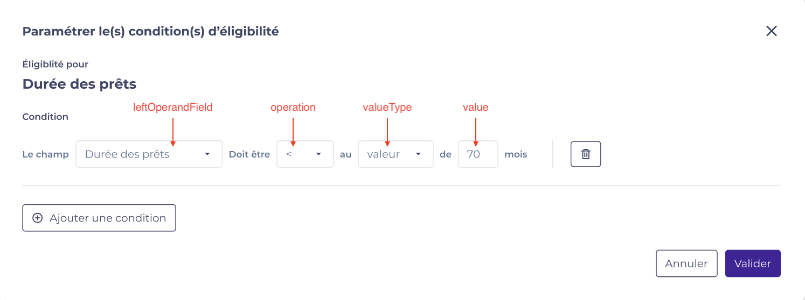
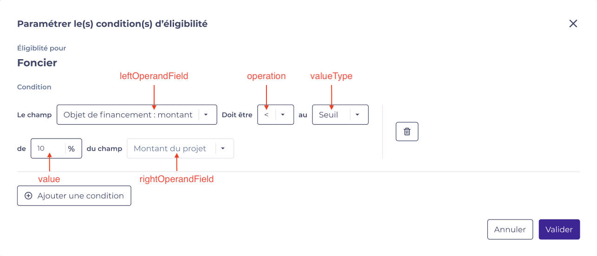
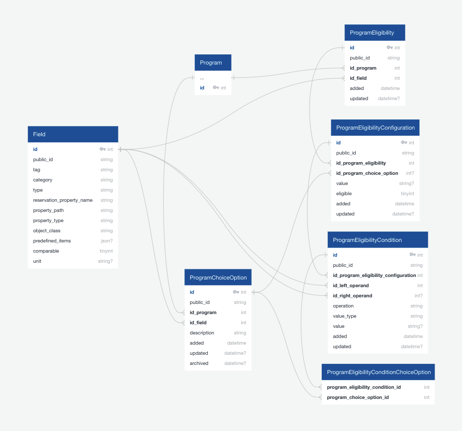

==============
Eligibility
==============

Introduction
============

While creating a program, CASA configures the conditions on some selected fields that distributors must fill in when they make the reservation requests.
That is called the eligibility.
For each criteria, we can add eligibility configurations, conditions, and define which one is eligible.

Composition
============

Each eligibility line is saved in ProgramEligibility entity, containing:
 - Field
 - Configurations
 - Conditions

Field
-------------
Defined beforehand and globally, they are saved in ``Field`` entity.
For each program, CASA configures eligibility with a fields list.

Possible categories:
 - profile
 - project
 - loan

The categories are used to indicate the context of a field and to group the field when we display them in the front-end.

Possible field types:
 - other : value type
 - bool
 - list

List typed values are saved in ProgramChoiceOption.

There are 2 levels for list type fields:
 - user-defined list (borrower type for example) : Each option is created / defined by the user when configuring the eligibility.
 - pre-defined list (legal form for example) : pre-defined items are saved in ``Field::predefinedItems``. Each items are created (in ProgramChoiceOption) when the project is created.

Illustration:

Configurations
-------------
For each eligibility field of bool type and list type, we can define for each "option" whether it's eligible by adding a ``ProgramEligibilityConfiguration``.
An eligibility field of value type has always a configuration of which the eligible is always true. It means that the field is required (any value is eligible).

Illustration for eligibility field of bool type :

Illustration for eligibility field of list type :

.. image:: ../../assets/images/creditguaranty/cg-eligibility-configuration-list.png
    :align: center
    :alt: eligibility configuration list

Conditions
-------------
We can add conditions for each eligibility configuration.
They saved in ``ProgramEligibilityCondition`` entity.

There are 2 condition types : rate (screenshot 1 below) - value (screenshot 2 below)

Relational schema
============

Validation
============
Once CASA configured eligibility, distributors can make reservation requests for the program.

There are 2 validation levels:
 - after filled in a form, we check eligibility configurations and return an ineligible fields list.
 - after filled in all forms, we check eligibility configurations with conditions and return an ineligible fields list.

In technical part, there are an entity request ``Eligiblity``, and an endpoint that checks reservation eligibility (see ``src/CreditGuaranty/Service/EligibilityChecker.php`` file for more details).
