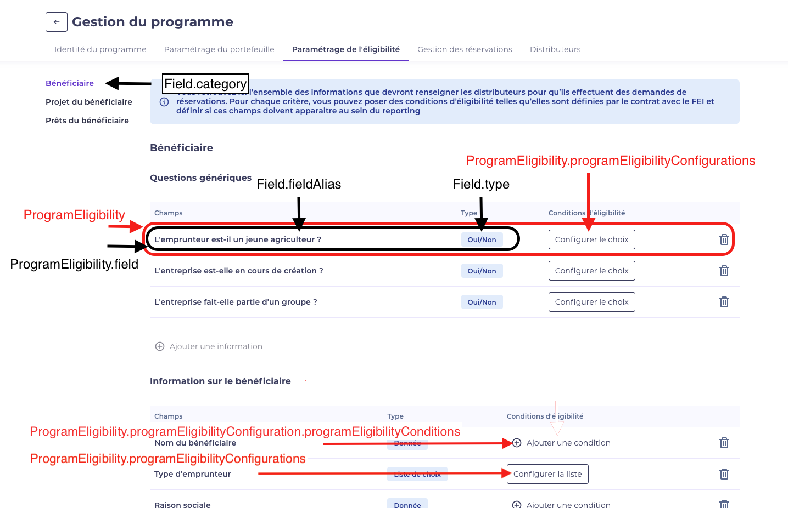
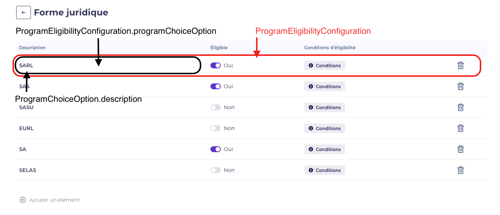

==============
Eligibility
==============

Introduction
============

In a program management, CASA configures eligibility related to selected fields
that distributors must fill in when they make the reservation requests.
For each eligibility criteria, we can have configurations, some conditions for a configuration,
and define which one is eligible.

Relational schema
============

.. image:: ../../assets/images/creditguaranty/cg-eligibility-db-schema.png
    :align: center
    :alt: eligibility db schema

Composition
============

Each eligibility line is saved in ProgramEligibility entity, containing:
 - Field
 - Configurations
 - Conditions

Illustration:

Field
-------------
Defined beforehand and globally, they are saved in ``Field`` entity.
In a program, CASA configures eligibility in selecting fields that he wants for distributors to fill in in a reservation request.

Possible tags (used for reporting):
 - eligibility (the configured fields in a program eligibility)
 - info
 - imported
 - calcul

Possible categories (used to indicate the section of a field and to group them when we display them in the front-end side):
 - profile (corresponding to borrower tab)
 - project (corresponding to project tab)
 - loan (corresponding to financing objects tab)

Possible field types:
 - other (for int, string, date, money values)
 - bool
 - list (which options values are saved in ProgramChoiceOption)
    - user-defined list (``borrowerType`` for example) : Each option is created / defined by the user when configuring the eligibility.
    - pre-defined list (``legalForm`` for example) : pre-defined items are saved in ``Field::predefinedItems`` and each items are created in ``ProgramChoiceOption``.
    - pre-defined list special (``companyNafCode`` or ``loanNafCode``) : pre-defined items are saved in a specific table ``NafNace``.

The property ``comparable`` is used to list fields that can be in a ``ProgramEligibilityCondition``.

To know which object property is related to which field, there are some properties in a ``Field`` model :
 - objectClass (only used in back-end side for eligibility checking of a reservation)
 - reservationPropertyName (corresponding to the property target from a reservation object)
 - propertyPath (corresponding to the property target from the reservationPropertyName if it exists)

Configurations
-------------
An eligibility configured in a program management must have at least one configuration.

An configuration must be created for each "value" of a field can have :
 - For other type field :
    - there must be only one configuration because there is only one possible value (i.e. string, int, date, money).
    - the configuration eligible value must be setted to ``true`` by default because if we configure a field of type other, it means the field must be filled in to have the reservation eligible.
    - the ``value`` and ``programChoiceOption`` properties of ``ProgramEligibilityConfiguration`` must be setted to NULL.
 - For bool type field :
    - there must be only two configurations (yes or no).
    - we can define which one is eligible depending on user (it is both setted eligible by default).
    - the ``value`` must be setted to ``1`` (true) or ``0`` (false), and ``programChoiceOption`` to NULL.
 - For list type field :
    - there must be one configuration by option configured.
    - the ``value`` must be setted to NULL, and ``programChoiceOption`` to the ``ProgramChoiceOption`` related.

Illustration of eligibility configuration for bool type field :

Illustration of eligibility configuration for list type field :

Conditions
-------------
Each configuration can have one or more conditions for a reservation to be eligible, saved in ``ProgramEligibilityCondition`` entity.
For explanation, when we add a condition in a configuration of a field A, which means that if the field A

The properties ``leftOperandField``, ``valueType`` and ``operation`` are required whatever the condition type.

There are 4 condition types :
 - Value type
    - it is for fields of type other with money, month or person unit.
    - the ``rightOperandField`` must be setted to NULL, and the ``value`` for the value to compare (decimal or amount).
 - Rate type
    - it is for fields of type other with money, month or person unit.
    - it is used to compare a field A value to another field B (of the same field type) value with a rate value.
    - the ``rightOperandField`` must then be setted, and also the ``value`` to multiply with the ``rightOperandField`` value to compare (decimal or amount) with the ``leftOperandField`` value.
 - Bool type
    - it is for fields of type bool.
    - the ``rightOperandField`` must be setted to NULL, and the ``value`` (1 or 0) for the value to compare.
 - List type
    - it is for fields of type list.
    - the ``rightOperandField`` and ``value`` values must be setted to NULL, and the ``programChoiceOptions`` collection must be contain at least one element.

Validation
============
Once CASA configured eligibility and distribute the program, distributors can make reservation requests for the program.

There are 2 validation levels:
 - after filled in a section of a reservation request, we check only eligibility configurations and return an ineligible fields list if it exists.
 - in submitting a reservation resquest, we check eligibility configurations with conditions, and return an ineligible fields list if it exists.

In the code, the endpoint is created in the ``Reservation`` resource and calls a custom controller checking the reservation eligibility.
